<div align="center">
  <h1>🚀 SkillLearning API</h1>
  <p>
    <strong>Uma API robusta e escalável construída com .NET 9, Clean Architecture e Padrões de Design Avançados.</strong>
  </p>
</div>

<p align="center">
  <a href="https://github.com/JonasMacielWork/SkillLearning/actions/workflows/ci.yml">
    
  </a>
  
  
  <a href="https://opensource.org/licenses/MIT">
    
  </a>
</p>

---

## 🎯 Sobre o Projeto

**SkillLearning** é um backend robusto para uma plataforma de aprendizado, construído com .NET 9, demonstrando:

- Arquitetura limpa e escalável  
- Padrões de design avançados  
- Stack moderna focada em performance e manutenibilidade  

> Projeto em desenvolvimento contínuo, funcionando como portfólio vivo e playground técnico.

---

## 🏗️ Diagrama de Arquitetura

```mermaid
%% Diagrama de Arquitetura de Sistema - SkillLearning v5
graph LR
    %% --- Definição dos Nós ---
    %% Nós com múltiplas linhas para Título e Tecnologia
    U(fa:fa-user Usuário)

    subgraph "Ambiente do Cliente"
        A["fa:fa-react Frontend<br/><i>React & TypeScript</i>"]
    end

    subgraph "Ambiente Cloud (AWS)"
        ALB["fa:fa-network-wired ALB<br/><i>(Load Balancer)</i>"]

        subgraph "Serviços da Aplicação (EKS)"
            direction TB
            B["fa:fa-server SkillLearning API<br/><i>ASP.NET Core</i>"]
            C["fa:fa-cogs Email Worker<br/><i>.NET Worker Service</i>"]
        end
        
        subgraph "Infraestrutura de Dados"
            direction TB
            D["fa:fa-database PostgreSQL<br/><i>Amazon RDS</i>"]
            E["fa:fa-memory Redis<br/><i>Amazon ElastiCache</i>"]
            F["fa:fa-comments Apache Kafka<br/><i>Amazon MSK</i>"]
        end
        
        H["fa:fa-tachometer-alt Observabilidade<br/><i>AWS X-Ray</i>"]
    end

    subgraph "Serviços de Terceiros"
        G["fa:fa-envelope Servidor SMTP<br/><i>(e.g., Amazon SES)</i>"]
    end
    
    %% --- Definição dos Fluxos ---
    U -- HTTPS --> A
    A -- Requisição API --> ALB
    ALB -- Roteia Tráfego --> B
    
    B -- Leitura/Escrita<br/>(SQL) --> D
    B -- Cache<br/>(Get/Set) --> E
    B -.->|Publica Evento| F
    
    F -->|Consome Evento| C
    C -->|Envia E-mail| G
    
    B & C -.->|Envia Traces| H
    
    %% --- Estilização (Tema TokyoNight) ---
    style U fill:#bb9af7,stroke:#1a1b26,stroke-width:2px,color:#1a1b26
    style A fill:#7aa2f7,stroke:#1a1b26,stroke-width:2px,color:#1a1b26
    style ALB fill:#c0caf5,stroke:#414868,stroke-width:2px,color:#1a1b26
    style B fill:#bb9af7,stroke:#414868,stroke-width:2px,color:#1a1b26
    style C fill:#bb9af7,stroke:#414868,stroke-width:2px,color:#1a1b26
    style D fill:#7dcfff,stroke:#414868,stroke-width:2px,color:#1a1b26
    style E fill:#ff9e64,stroke:#414868,stroke-width:2px,color:#1a1b26
    style F fill:#f7768e,stroke:#414868,stroke-width:2px,color:#1a1b26
    style G fill:#e0af68,stroke:#414868,stroke-width:2px,color:#1a1b26
    style H fill:#9ece6a,stroke:#414868,stroke-width:2px,color:#1a1b26
```



---

## ✨ Features Principais

-   **Autenticação e Autorização:** Sistema completo com registro, login via JWT e refresh tokens.
-   **Notificações em Tempo Real:** Painel de atividades que exibe eventos (novos usuários, logins) em tempo real usando **SignalR**.
-   **Comunicação Assíncrona:** Envio de e-mails de boas-vindas e notificação de login de forma desacoplada, através de um sistema de mensageria com **Kafka**.
-   **Cache de Performance:** Uso de **Redis** para cachear queries de leitura, reduzindo a carga no banco de dados.
-   **Observabilidade:** Integração com **AWS X-Ray** para tracing distribuído das requisições.

---

## 🏗️ Arquitetura e Padrões

A fundação do projeto é baseada em princípios que garantem um sistema manutenível, testável e desacoplado.

-   **Arquitetura Limpa (Clean Architecture):** Separação de responsabilidades em camadas (`Domain`, `Application`, `Infrastructure`, `Presentation`), com o fluxo de dependências sempre apontando para o núcleo do negócio.
-   **Domain-Driven Design (DDD) Tático:** As entidades (ex: `User`) são ricas em comportamento, encapsulando a lógica de negócio e evitando modelos anêmicos.
-   **CQRS (Command and Query Responsibility Segregation):** Operações de escrita (Commands) e leitura (Queries) são segregadas, permitindo otimizações e lógicas independentes para cada fluxo.
-   **Padrão Mediator:** Com o uso de `MediatR` para orquestrar as operações na camada de aplicação, mantendo os controllers limpos e focados em roteamento e validação.

---

## 🛠️ Stack de Tecnologias

| Categoria          | Tecnologia/Ferramenta                                  |
| ------------------ | ------------------------------------------------------ |
| **Backend** | .NET 9, ASP.NET Core, C#                               |
| **Comunicação** | API REST, SignalR                                      |
| **Banco de Dados** | PostgreSQL, Entity Framework Core                      |
| **Mensageria** | Apache Kafka, Confluent.Kafka Client                   |
| **Cache** | Redis (Cache Distribuído)                              |
| **Autenticação** | JWT (JSON Web Tokens)                                  |
| **Testes** | xUnit, Moq, FluentAssertions, Testcontainers           |
| **Container** | Docker & Docker Compose                                |
| **CI/CD** | GitHub Actions                                         |
| **Observabilidade**| AWS X-Ray                                              |
| **Documentação** | Swagger (OpenAPI)                                      |

---

### 🏛️ Estrutura do Projeto

Abaixo está a estrutura de pastas do backend, refletindo os princípios da Arquitetura Limpa.

```
Backend
├── SkillLearning.Api
│   ├── Contracts
│   │   └── UpdateEmailRequest.cs
│   ├── Controllers
│   │   ├── Auth
│   │   └── Common
│   ├── Extensions
│   │   └── ServiceCollectionExtensions.cs
│   ├── Hubs
│   │   └── ActivityHub.cs
│   ├── Middlewares
│   │   └── ExceptionHandlingMiddleware.cs
│   ├── Services
│   │   └── SignalRActivityNotifier.cs
│   ├── Program.cs
│   ├── SkillLearning.Api.csproj
│   ├── SkillLearning.Api.http
│   ├── appsettings.Development.json
│   └── appsettings.json
├── SkillLearning.Application
│   ├── Common
│   │   ├── Behaviors
│   │   ├── Configuration
│   │   ├── Errors
│   │   ├── Interfaces
│   │   └── Models
│   ├── Features
│   │   ├── Auth
│   │   └── Users
│   └── SkillLearning.Application.csproj
├── SkillLearning.Domain
│   ├── Common
│   │   └── EntityBase.cs
│   ├── Entities
│   │   ├── RefreshToken.cs
│   │   └── User.cs
│   ├── Enums
│   │   └── UserRole.cs
│   ├── Events
│   │   ├── UserLoginEvent.cs
│   │   └── UserRegisteredEvent.cs
│   └── SkillLearning.Domain.csproj
├── SkillLearning.Infrastructure
│   ├── Configuration
│   │   └── EmailSettings.cs
│   ├── Persistence
│   │   ├── Configurations
│   │   ├── Migrations
│   │   ├── Repositories
│   │   ├── ApplicationDbContext.cs
│   │   ├── ApplicationDbContextFactory.cs
│   │   ├── ApplicationReadDbContext.cs
│   │   ├── ApplicationWriteDbContext.cs
│   │   ├── DbContextBase.cs
│   │   └── QueryPerformanceInterceptor.cs
│   ├── Services
│   │   ├── AuthService.cs
│   │   ├── EmailSender.cs
│   │   ├── KafkaConsumerService.cs
│   │   ├── KafkaProducerService.cs
│   │   └── RedisCacheService.cs
│   └── SkillLearning.Infrastructure.csproj
├── SkillLearning.Tests
│   ├── IntegrationTests
│   │   ├── EmailSenderTests.cs
│   │   ├── KafkaConsumerServiceTests.cs
│   │   ├── KafkaMessagingTests.cs
│   │   ├── QueryPerformanceInterceptorTests.cs
│   │   ├── ReadDbContextTests.cs
│   │   ├── RedisCacheServiceTests.cs
│   │   └── UserRepositoryTests.cs
│   ├── TestHelpers
│   │   └── ListLogger.cs
│   ├── UnitTests
│   │   ├── Auth
│   │   ├── Domain
│   │   ├── Services
│   │   ├── Users
│   │   ├── CheckUserExistsQueryHandlerTests.cs
│   │   ├── GetUserByUsernameQueryHandlerTests.cs
│   │   ├── LoginNotificationEventHandlerTests.cs
│   │   ├── LoginUserCommandHandlerTests.cs
│   │   ├── LoginUserCommandValidatorTests.cs
│   │   ├── RegisterUserCommandHandlerTests.cs
│   │   ├── RegisterUserCommandValidatorTests.cs
│   │   └── ValidationBehaviorTests.cs
│   └── SkillLearning.Tests.csproj
└── SkillLearning.Workers.EmailSender
    ├── Services
    │   └── LoginEventConsumerHostedService.cs
    ├── Program.cs
    ├── SkillLearning.Workers.EmailSender.csproj
    ├── appsettings.Development.json
    └── appsettings.json

42 directories, 53 files
```

---

## 🚀 Executando com Docker (Método Recomendado)

A maneira mais simples e consistente de executar todo o ambiente (API, Worker, Banco de Dados, Cache e Mensageria) é utilizando Docker.

### Pré-requisitos
* [.NET 9 SDK](https://dotnet.microsoft.com/download/dotnet/9.0)
* [Docker Desktop](https://www.docker.com/products/docker-desktop)

### Passos

1.  **Clone o Repositório**
    ```bash
    git clone https://github.com/JonasMacielWork/SkillLearning.git
    cd SkillLearning
    ```

2.  **Configure os Segredos Locais**
    Na pasta `Build/`, crie um arquivo chamado `.env`. Este arquivo **não será versionado** e guardará seus segredos. Copie o conteúdo abaixo e preencha com seus valores.
    ```dotenv
    # Build/.env - Arquivo de segredos para o ambiente Docker

    # Banco de Dados
    POSTGRES_DB=skilllearning_db
    POSTGRES_USERNAME=admin
    POSTGRES_PASSWORD=admin

    # JWT (use uma chave secreta forte e longa)
    JWT_KEY="UMA_CHAVE_SECRETA_FORTE_COM_MAIS_DE_32_CARACTERES"

    # Configurações de E-mail (use um App Password do Gmail se tiver 2FA)
    EMAIL_SENDER_USER="seu-email@gmail.com"
    EMAIL_SENDER_PASSWORD="sua-senha-de-app"

    # Chaves AWS (opcional, para X-Ray)
    AWS_ACCESS_KEY_ID=seu-access-key
    AWS_SECRET_ACCESS_KEY=sua-secret-key
    AWS_REGION=us-east-1
    ```

3.  **Inicie todos os Serviços**
    Com o Docker Desktop em execução, rode o seguinte comando na **raiz do projeto**:
    ```bash
    docker-compose -f build/docker-compose.yml up -d --build
    ```
    Este comando irá construir as imagens e iniciar todos os contêineres em segundo plano.

4.  **Acesse a Aplicação**
    A API está configurada para aplicar as migrações do banco de dados automaticamente na inicialização. Aguarde cerca de um minuto para todos os serviços estabilizarem.
    * **API:** `https://localhost:7140` (verifique a porta no seu `launchSettings.json`)
    * **Documentação (Swagger):** `https://localhost:7140/swagger`
    * **Kafka UI:** `http://localhost:8080`
    * **Redis Insight:** `http://localhost:8081`

---

## 🧪 Rodando os Testes

Para executar a suíte de testes unitários e de integração, utilize o comando na raiz do projeto:

```bash
dotnet test
```

## 📄 Licença

Este projeto está licenciado sob a [Licença MIT](LICENSE).

## 📬 Contato e Redes

Se você tiver alguma dúvida, sugestão, feedback sobre o projeto ou apenas quiser trocar uma ideia sobre tecnologia, ficarei feliz em conversar. Me encontre em qualquer um destes canais:

<p align="left">
  <a href="https://www.linkedin.com/in/jonas-maciell/" target="_blank">
    
  </a>
  <a href="mailto:jonasmacielwork@gmail.com">
    
  </a>
  <a href="https://github.com/JonasMacielWork" target="_blank">
    
  </a>
</p>
