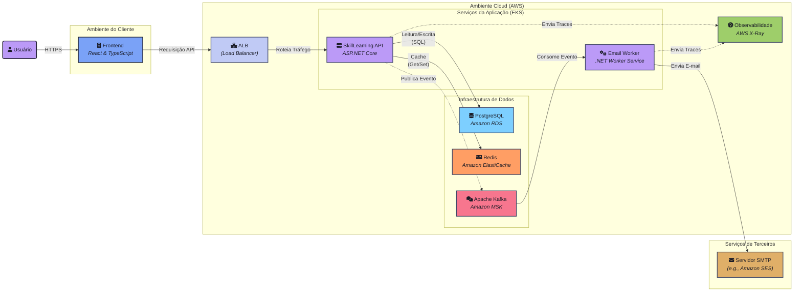

<div align="center">
  <h1>🚀 SkillLearning API</h1>
  <p>
    <strong>Uma API robusta e escalável construída com .NET 9, Clean Architecture e Padrões de Design Avançados.</strong>
  </p>
</div>

<p align="center">
  <a href="https://github.com/JonasMacielWork/SkillLearning/actions/workflows/ci.yml">
    
  </a>
  
  
  <a href="https://opensource.org/licenses/MIT">
    
  </a>
</p>

---

## 🎯 Sobre o Projeto

**SkillLearning** é um backend robusto para uma plataforma de aprendizado, construído com .NET 9, demonstrando:

- Arquitetura limpa e escalável  
- Padrões de design avançados  
- Stack moderna focada em performance e manutenibilidade  

> Projeto em desenvolvimento contínuo, funcionando como portfólio vivo e playground técnico.

---

## 🏗️ Diagrama de Arquitetura



---

## ✨ Features Principais

-   **Autenticação e Autorização:** Sistema completo com registro, login via JWT e refresh tokens.
-   **Notificações em Tempo Real:** Painel de atividades que exibe eventos (novos usuários, logins) em tempo real usando **SignalR**.
-   **Comunicação Assíncrona:** Envio de e-mails de boas-vindas e notificação de login de forma desacoplada, através de um sistema de mensageria com **Kafka**.
-   **Cache de Performance:** Uso de **Redis** para cachear queries de leitura, reduzindo a carga no banco de dados.
-   **Observabilidade:** Integração com **AWS X-Ray** para tracing distribuído das requisições.

---

## 🏗️ Arquitetura e Padrões

A fundação do projeto é baseada em princípios que garantem um sistema manutenível, testável e desacoplado.

-   **Arquitetura Limpa (Clean Architecture):** Separação de responsabilidades em camadas (`Domain`, `Application`, `Infrastructure`, `Presentation`), com o fluxo de dependências sempre apontando para o núcleo do negócio.
-   **Domain-Driven Design (DDD) Tático:** As entidades (ex: `User`) são ricas em comportamento, encapsulando a lógica de negócio e evitando modelos anêmicos.
-   **CQRS (Command and Query Responsibility Segregation):** Operações de escrita (Commands) e leitura (Queries) são segregadas, permitindo otimizações e lógicas independentes para cada fluxo.
-   **Padrão Mediator:** Com o uso de `MediatR` para orquestrar as operações na camada de aplicação, mantendo os controllers limpos e focados em roteamento e validação.

---

## 🛠️ Stack de Tecnologias

| Categoria          | Tecnologia/Ferramenta                                  |
| ------------------ | ------------------------------------------------------ |
| **Backend** | .NET 9, ASP.NET Core, C#                               |
| **Comunicação** | API REST, SignalR                                      |
| **Banco de Dados** | PostgreSQL, Entity Framework Core                      |
| **Mensageria** | Apache Kafka, Confluent.Kafka Client                   |
| **Cache** | Redis (Cache Distribuído)                              |
| **Autenticação** | JWT (JSON Web Tokens)                                  |
| **Testes** | xUnit, Moq, FluentAssertions, Testcontainers           |
| **Container** | Docker & Docker Compose                                |
| **CI/CD** | GitHub Actions                                         |
| **Observabilidade**| AWS X-Ray                                              |
| **Documentação** | Swagger (OpenAPI)                                      |

---

### 🏛️ Estrutura do Projeto

Abaixo está a estrutura de pastas do backend, refletindo os princípios da Arquitetura Limpa.

{{project_tree}}

---

## 🚀 Executando com Docker (Método Recomendado)

A maneira mais simples e consistente de executar todo o ambiente (API, Worker, Banco de Dados, Cache e Mensageria) é utilizando Docker.

### Pré-requisitos
* [.NET 9 SDK](https://dotnet.microsoft.com/download/dotnet/9.0)
* [Docker Desktop](https://www.docker.com/products/docker-desktop)

### Passos

1.  **Clone o Repositório**
    ```bash
    git clone https://github.com/JonasMacielWork/SkillLearning.git
    cd SkillLearning
    ```

2.  **Configure os Segredos Locais**
    Na pasta `Build/`, crie um arquivo chamado `.env`. Este arquivo **não será versionado** e guardará seus segredos. Copie o conteúdo abaixo e preencha com seus valores.
    ```dotenv
    # Build/.env - Arquivo de segredos para o ambiente Docker

    # Banco de Dados
    POSTGRES_DB=skilllearning_db
    POSTGRES_USERNAME=admin
    POSTGRES_PASSWORD=admin

    # JWT (use uma chave secreta forte e longa)
    JWT_KEY="UMA_CHAVE_SECRETA_FORTE_COM_MAIS_DE_32_CARACTERES"

    # Configurações de E-mail (use um App Password do Gmail se tiver 2FA)
    EMAIL_SENDER_USER="seu-email@gmail.com"
    EMAIL_SENDER_PASSWORD="sua-senha-de-app"

    # Chaves AWS (opcional, para X-Ray)
    AWS_ACCESS_KEY_ID=seu-access-key
    AWS_SECRET_ACCESS_KEY=sua-secret-key
    AWS_REGION=us-east-1
    ```

3.  **Inicie todos os Serviços**
    Com o Docker Desktop em execução, rode o seguinte comando na **raiz do projeto**:
    ```bash
    docker-compose -f build/docker-compose.yml up -d --build
    ```
    Este comando irá construir as imagens e iniciar todos os contêineres em segundo plano.

4.  **Acesse a Aplicação**
    A API está configurada para aplicar as migrações do banco de dados automaticamente na inicialização. Aguarde cerca de um minuto para todos os serviços estabilizarem.
    * **API:** `https://localhost:7140` (verifique a porta no seu `launchSettings.json`)
    * **Documentação (Swagger):** `https://localhost:7140/swagger`
    * **Kafka UI:** `http://localhost:8080`
    * **Redis Insight:** `http://localhost:8081`

---

## 🧪 Rodando os Testes

Para executar a suíte de testes unitários e de integração, utilize o comando na raiz do projeto:

```bash
dotnet test
```

## 📄 Licença

Este projeto está licenciado sob a [Licença MIT](LICENSE).

## 📬 Contato e Redes

Se você tiver alguma dúvida, sugestão, feedback sobre o projeto ou apenas quiser trocar uma ideia sobre tecnologia, ficarei feliz em conversar. Me encontre em qualquer um destes canais:

<p align="left">
  <a href="https://www.linkedin.com/in/jonas-maciell/" target="_blank">
    
  </a>
  <a href="mailto:jonasmacielwork@gmail.com">
    
  </a>
  <a href="https://github.com/JonasMacielWork" target="_blank">
    
  </a>
</p>
